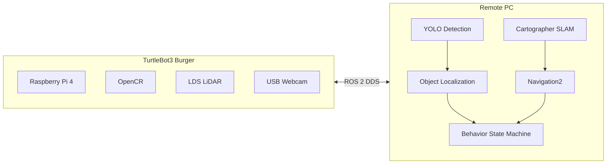

<div align="center">

# Nav2gather

### Toward Cooperative Multi-Robot Navigation

Navigation2 기반 객체 인식 자율주행 시스템을 구현하고, 이후 다중 로봇 협력 주행(Multi-Robot Navigation)으로 확장하기 위한 프로젝트이다.


</div>

<br>

<div align="center">

<video src="videos/Behavior%20Demo.mp4" controls width="720">
데모 영상: <a href="videos/Behavior%20Demo.mp4">Behavior Demo.mp4</a>
</video>

<sub><i>Object Detection → Localization → Behavior → Navigation2로 이어지는 전체 동작</i></sub>

</div>

<br>

## 목차

- [프로젝트 개요](#프로젝트-개요)
- [핵심 기능](#핵심-기능)
- [시스템 아키텍처](#시스템-아키텍처)
- [전체 동작 흐름](#전체-동작-흐름)
- [Behavior 상태 머신](#behavior-상태-머신)
- [SLAM & Navigation2](#slam--navigation2)
- [기술 스택](#기술-스택)
- [프로젝트 구조](#프로젝트-구조)
- [구현 현황](#구현-현황)
- [향후 계획](#향후-계획)
- [문서](#문서)

---

## 프로젝트 개요

**Nav2gather**는 TurtleBot3 Burger를 기반으로 Navigation2, Object Detection, Object Localization, Behavior를 통합한 **객체 인식 자율주행 시스템**이다.

로봇은 카메라 영상에서 YOLO로 목표 물체를 인식하고, 인식된 위치를 카메라 좌표계에서 map 좌표계로 변환해 Navigation2의 목표 지점으로 사용한다. 사람이 RViz에서 목적지를 직접 지정하는 방식 대신, **인식된 객체를 스스로 목적지로 삼아 이동**하는 것이 이 시스템의 핵심 구조다.

TurtleBot3 Burger는 Raspberry Pi 4·LiDAR·USB 웹캠으로 센서 수집과 구동만 담당하고, SLAM·Navigation2·YOLO 추론처럼 연산량이 큰 작업은 Remote PC에서 처리하는 Offloading 구조를 채택했다.

현재는 단일 로봇을 대상으로 인식 기반 자율주행 파이프라인을 구현했으며, 이후 여러 대의 로봇이 역할을 나누어 함께 주행하는 **Multi-Robot Navigation**으로 확장하는 것을 목표로 한다.

## 핵심 기능

| 구성 요소 | 설명 |
|---|---|
| **Object Detection** | USB 웹캠 영상을 `yolo_ros`로 실시간 추론해 목표 물체를 탐지한다. 신뢰도 임계값과 bounding box 크기 필터로 오검출을 제거한다. |
| **Object Localization** | Bounding Box 폭과 카메라 초점거리를 이용한 Pinhole 카메라 모델로 물체의 3D 위치를 추정한다. LiDAR 클러스터링과 YOLO 방위각을 융합해 위치를 보정하는 방식도 함께 구현되어 있다. |
| **Navigation2** | Cartographer SLAM으로 생성한 지도 위에서 AMCL로 위치를 추정하고, `nav2_simple_commander`로 전역/지역 경로 계획과 장애물 회피를 수행한다. |
| **Behavior** | 탐색·정렬·좌표 안정화·이동·재탐색을 상태 머신으로 관리해, 인식된 객체를 목표로 자율주행을 반복 수행한다. |

## 시스템 아키텍처

로봇은 센서·구동만 담당하고, 연산이 무거운 SLAM·Navigation2·YOLO·Behavior는 Remote PC에서 실행되며 두 장치는 ROS 2 DDS로 통신한다.



## 전체 동작 흐름

```text
USB Camera
     │
     ▼
YOLO Detection
     │
     ▼
Object Localization
     │
     ▼
TF Transformation
     │
     ▼
Behavior Decision
     │
     ▼
Navigation2
     │
     ▼
Robot Motion
```

<div align="center">

<video src="videos/yolo_detection.mp4" controls width="640">
데모 영상: <a href="videos/yolo_detection.mp4">yolo_detection.mp4</a>
</video>

<sub><i>USB 웹캠 영상에서 YOLO가 목표 물체를 실시간으로 탐지하는 모습</i></sub>

</div>

좌표계는 `camera_optical_frame → camera_link → base_link → odom → map` 순서로 정적/동적 TF 변환을 거쳐 연결되며, 카메라 장착 위치는 정적 TF로 보정되어 있다.

## Behavior 상태 머신

Behavior 노드는 아래 상태를 순환하며 인식된 객체를 향해 자율주행을 수행한다.

```text
Searching
    │   Object Detected
    ▼
Aligning
    │   Centered in Frame
    ▼
Collecting
    │   Coordinate Samples Stabilized
    ▼
Navigating
    │   Goal Reached
    ▼
Cooldown
    │   Next Target
    └────────────────────┐
                         ▼
                    Searching
```

탐색 또는 이동이 반복적으로 실패하면 `Navigating`, `Searching` 단계에서 `Stopped` 상태로 안전하게 종료된다.

| 단계 | 코드 상태(enum) | 설명 |
|---|---|---|
| Searching | `SEARCHING` | 제자리 회전하며 목표 물체를 탐색 |
| Aligning | `ALIGNING` | 각도 오차를 계산해 물체가 화면 중앙에 오도록 정렬 |
| Collecting | `PREPARING_GOAL` | 여러 프레임의 좌표 샘플을 모아 중앙값으로 안정화 |
| Navigating | `NAVIGATING` | 안정화된 좌표 앞 정지 지점을 목표로 생성해 Nav2로 이동 |
| Cooldown | `COOLDOWN` | 도착 후 대기하며 동일 목표 재탐색을 방지 |
| — | `STOPPED` | 재시도·탐색 한계 초과 시 안전 종료 |

이미 도착한 목표의 map 좌표는 계속 유지되어 다음 탐색 루프에서 자동으로 제외되며, 이는 이후 여러 로봇이 좌표를 공유하며 협력 주행하는 구조로 확장될 수 있는 기반이 된다.

## SLAM & Navigation2

<table>
<tr>
<td width="45%">


<sub><i>Cartographer SLAM으로 생성한 점유 격자 지도(occupancy grid map)</i></sub>

</td>
<td width="55%">

<video src="videos/slam.MP4" controls width="100%">
데모 영상: <a href="videos/slam.MP4">slam.MP4</a>
</video>

<sub><i>LiDAR 기반 실시간 지도 생성 과정</i></sub>

</td>
</tr>
</table>

<div align="center">

<video src="videos/navigation.mp4" controls width="640">
데모 영상: <a href="videos/navigation.mp4">navigation.mp4</a>
</video>

<sub><i>저장된 지도 위에서 AMCL 위치 추정과 Navigation2 목표 지점 이동</i></sub>

</div>

## 기술 스택

| 구분 | 내용 |
|---|---|
| **OS** | Ubuntu 24.04 LTS |
| **Middleware** | ROS 2 Jazzy |
| **Robot Platform** | TurtleBot3 Burger (Raspberry Pi 4 · OpenCR · LDS-02 LiDAR) |
| **Perception** | USB Webcam · [`yolo_ros`](code/yolo_ws/src/yolo_ros) (Ultralytics YOLO) |
| **Navigation** | Navigation2 · Cartographer SLAM · `nav2_simple_commander` |
| **Simulation / Viz** | Gazebo Harmonic · RViz2 |
| **Language** | Python · C++ |
| **Build System** | colcon |

## 프로젝트 구조

```text
Nav2gather/
├── code/
│   ├── turtlebot3_ws/                  Raspberry Pi - 센서 · 구동
│   └── yolo_ws/                        Remote PC - 인식 · 자율주행
│       └── src/
│           ├── yolo_ros/                    YOLO 추론 (외부 오픈소스 패키지)
│           ├── nav2_behavior/                Object Localization · TF · Behavior 상태 머신
│           ├── frontier_exploration_ros2/    Frontier Exploration (외부 패키지, 연동 중)
│           ├── yolo_behavior/                 Behavior 초기 실험 노드
│           └── bottle_behavior/              탐지 후 정지 실험 노드
├── docs/                                설치 · 실행 가이드북
├── images/                              스크린샷 · 다이어그램
├── videos/                              시연 영상
└── presentation/                        발표 자료
```

`yolo_ros`, `frontier_exploration_ros2`는 각각 [mgonzs13](https://github.com/mgonzs13/yolo_ros), [mertgulerx](https://github.com/mertgulerx/frontier-exploration-ros2)의 오픈소스 패키지를 워크스페이스에 통합해 사용한다.

## 구현 현황

| 항목 | 상태 |
|---|---|
| TurtleBot3 Bringup | Done |
| Cartographer 기반 SLAM | Done |
| Navigation2 기반 자율주행 | Done |
| YOLO 기반 객체 인식 | Done |
| Object Localization (Pinhole 모델 3D 위치 추정) | Done |
| Camera-LiDAR 융합 위치 보정 | Done |
| TF 좌표 변환 (camera → map) | Done |
| Behavior 상태 머신 기반 자율 탐색·접근 | Done |
| Frontier Exploration 자율 탐색 | 연동 구조 구성, 실환경 검증 진행 중 |
| Multi-Robot Navigation | 계획 단계 |

## 향후 계획

- **Multi-Robot Navigation** — Burger·Waffle 동시 자율주행, Namespace 기반 다중 로봇 환경 구성
- **Costmap 기반 Robot-to-Robot Avoidance** — 로봇 간 자연스러운 회피
- **MAPF (Multi-Agent Path Finding)** — 다중 로봇 충돌 없는 경로 계획
- **Autonomous Exploration** — Frontier Exploration 실환경 검증, 목적지 자동 탐색
- **Navigation Behavior 고도화** — 재시도 전략 · Recovery Behavior · Behavior Tree 분석

## 문서

프로젝트를 처음부터 재현하기 위한 상세 가이드는 `docs/` 폴더에 정리되어 있다.

| 문서 | 내용 |
|---|---|
| [01. Guidebook — Part 1](docs/01_Guidebook_Part1) | 개발 환경 구축 · TurtleBot3 Bringup |
| [02. Guidebook — Part 2](docs/02_Guidebook_Part2) | SLAM · Navigation2 |
| [03. Webcam Setup](docs/03_Webcam_Setup) | USB Webcam · YOLO 연동 |
| [04. Troubleshooting](docs/04_Troubleshooting) | 개발 중 발생한 문제와 해결 기록 |
