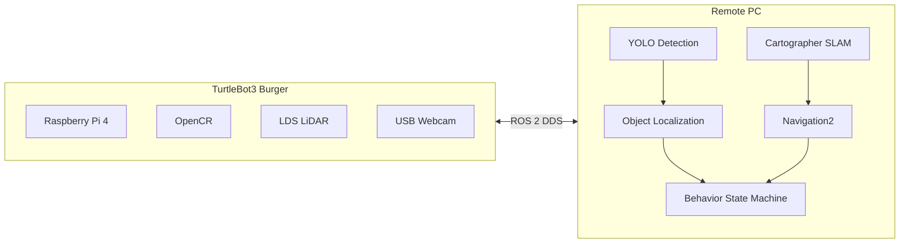

<div align="center">

# Nav2gather

### Toward Cooperative Multi-Robot Navigation

Navigation2 기반 객체 인식 자율주행 시스템을 구현하고, 이후 다중 로봇 협력 주행(Multi-Robot Navigation)으로 확장하기 위한 프로젝트이다.

</div>

<br>

<div align="center">

<video src="videos/Behavior%20Demo.mp4" controls width="720">
데모 영상: <a href="videos/Behavior%20Demo.mp4">Behavior Demo.mp4</a>
</video>

<sub><i>SLAM · Navigation2 · Object Detection · Localization · Behavior가 결합된 전체 시스템 동작</i></sub>

</div>

<br>

## 목차

- [프로젝트 개요](#프로젝트-개요)
- [시스템 아키텍처](#시스템-아키텍처)
- [개발 환경](#개발-환경)
- [SLAM](#slam)
- [Navigation2](#navigation2)
- [YOLO Object Detection](#yolo-object-detection)
- [Object Localization](#object-localization)
- [Behavior 상태 머신](#behavior-상태-머신)
- [구현 결과](#구현-결과)
- [향후 계획](#향후-계획)

---

## 프로젝트 개요

**Nav2gather**는 TurtleBot3 Burger를 기반으로 Navigation2, Object Detection, Object Localization, Behavior를 통합한 **객체 인식 자율주행 시스템**이다.

로봇은 카메라 영상에서 YOLO로 목표 물체를 인식하고, 인식된 위치를 카메라 좌표계에서 map 좌표계로 변환해 Navigation2의 목표 지점으로 사용한다. 사람이 RViz에서 목적지를 직접 지정하는 방식 대신, **인식된 객체를 스스로 목적지로 삼아 이동**하는 것이 이 시스템의 핵심 구조다.

TurtleBot3 Burger는 Raspberry Pi 4·LiDAR·USB 웹캠으로 센서 수집과 구동만 담당하고, SLAM·Navigation2·YOLO 추론처럼 연산량이 큰 작업은 Remote PC에서 처리하는 Offloading 구조를 채택했다.

현재는 단일 로봇을 대상으로 인식 기반 자율주행 파이프라인을 구현했으며, 이후 여러 대의 로봇이 역할을 나누어 함께 주행하는 **Multi-Robot Navigation**으로 확장하는 것을 목표로 한다.

## 시스템 아키텍처

로봇은 센서·구동만 담당하고, 연산이 무거운 SLAM·Navigation2·YOLO·Behavior는 Remote PC에서 실행되며 두 장치는 ROS 2 DDS로 통신한다.



전체 파이프라인은 아래와 같은 순서로 이어진다.

```text
USB Camera
     │
     ▼
YOLO Detection
     │
     ▼
Object Localization
     │
     ▼
TF Transformation
     │
     ▼
Behavior Decision
     │
     ▼
Navigation2
     │
     ▼
Robot Motion
```

## 개발 환경

| 구분 | 내용 |
|---|---|
| **OS** | Ubuntu 24.04 LTS |
| **Middleware** | ROS 2 Jazzy |
| **Robot Platform** | TurtleBot3 Burger (Raspberry Pi 4 · OpenCR · LDS-02 LiDAR) |
| **Perception** | USB Webcam · [`yolo_ros`](code/yolo_ws/src/yolo_ros) (Ultralytics YOLO) |
| **Navigation** | Navigation2 · Cartographer SLAM · `nav2_simple_commander` |
| **Simulation / Viz** | Gazebo Harmonic · RViz2 |
| **Language** | Python · C++ |
| **Build System** | colcon |

## SLAM

Cartographer로 LiDAR 스캔을 이용해 실시간 점유 격자 지도(occupancy grid map)를 생성한다. TurtleBot3를 원격 조작해 매핑 대상 공간을 주행시키고, 완성된 지도를 저장해 이후 Navigation2에서 사용한다.

<table>
<tr>
<td width="45%">


<sub><i>Cartographer SLAM으로 생성한 점유 격자 지도</i></sub>

</td>
<td width="55%">

<video src="videos/slam.MP4" controls width="100%">
데모 영상: <a href="videos/slam.MP4">slam.MP4</a>
</video>

<sub><i>LiDAR 기반 실시간 지도 생성 과정</i></sub>

</td>
</tr>
</table>

## Navigation2

저장된 지도 위에서 AMCL로 현재 위치를 추정하고, `nav2_simple_commander`(BasicNavigator)를 통해 전역/지역 경로 계획, 장애물 회피, 목표 지점 이동을 수행한다. 뒤에서 다루는 Behavior 노드는 이 인터페이스를 그대로 사용해 인식된 객체 앞 지점을 Nav2 목표로 전달한다.

<div align="center">

<video src="videos/navigation.mp4" controls width="640">
데모 영상: <a href="videos/navigation.mp4">navigation.mp4</a>
</video>

<sub><i>AMCL 위치 추정과 Navigation2 목표 지점 자율 이동</i></sub>

</div>

## YOLO Object Detection

Raspberry Pi에 연결된 USB 웹캠 영상을 GStreamer로 Remote PC에 전송해 ROS 2 Image Topic으로 변환하고, `yolo_ros`(Ultralytics YOLO 기반)로 실시간 추론한다. 신뢰도(score) 임계값과 bounding box 크기 필터를 적용해 목표 클래스만 선별한다.

<div align="center">

<video src="videos/yolo_detection.mp4" controls width="640">
데모 영상: <a href="videos/yolo_detection.mp4">yolo_detection.mp4</a>
</video>

<sub><i>USB 웹캠 영상에서 YOLO가 목표 물체를 실시간으로 탐지하는 모습</i></sub>

</div>

## Object Localization

검출된 bounding box의 폭과 카메라 초점거리를 이용한 Pinhole 카메라 모델로 카메라 기준 물체의 3D 좌표(거리·각도)를 추정한다.

```text
distance = (real_object_width × focal_length_px) / bbox_width_px
```

별도 구현에서는 YOLO 검출 방위각과 LiDAR 스캔 클러스터링을 결합해 더 강건하게 위치를 보정한다. 추정된 좌표는 `camera_optical_frame → camera_link → base_link → odom → map` TF 체인을 거쳐 map 좌표계로 변환되고, Behavior 노드의 목표 지점으로 전달된다.

## Behavior 상태 머신

Behavior 노드는 Navigation2와 Object Localization의 결과를 입력받아, 아래 상태를 순환하며 인식된 객체를 향해 자율주행을 수행하는 상위 로직이다.

```text
Searching
    │   Object Detected
    ▼
Aligning
    │   Centered in Frame
    ▼
Collecting
    │   Coordinate Samples Stabilized
    ▼
Navigating
    │   Goal Reached
    ▼
Cooldown
    │   Next Target
    └────────────────────┐
                         ▼
                    Searching
```

탐색 또는 이동이 반복적으로 실패하면 `Navigating`, `Searching` 단계에서 `Stopped` 상태로 안전하게 종료된다.

| 단계 | 코드 상태(enum) | 설명 |
|---|---|---|
| Searching | `SEARCHING` | 제자리 회전하며 목표 물체를 탐색 |
| Aligning | `ALIGNING` | 각도 오차를 계산해 물체가 화면 중앙에 오도록 정렬 |
| Collecting | `PREPARING_GOAL` | 여러 프레임의 좌표 샘플을 모아 중앙값으로 안정화 |
| Navigating | `NAVIGATING` | 안정화된 좌표 앞 정지 지점을 목표로 생성해 Nav2로 이동 |
| Cooldown | `COOLDOWN` | 도착 후 대기하며 동일 목표 재탐색을 방지 |
| — | `STOPPED` | 재시도·탐색 한계 초과 시 안전 종료 |

이미 도착한 목표의 map 좌표는 계속 유지되어 다음 탐색 루프에서 자동으로 제외되며, 이는 이후 여러 로봇이 좌표를 공유하며 협력 주행하는 구조로 확장될 수 있는 기반이 된다.

<div align="center">

<video src="videos/Behavior%20Demo.mp4" controls width="640">
데모 영상: <a href="videos/Behavior%20Demo.mp4">Behavior Demo.mp4</a>
</video>

<sub><i>Searching → Aligning → Collecting → Navigating → Cooldown 전체 루프</i></sub>

</div>

## 구현 결과

| 항목 | 상태 |
|---|---|
| TurtleBot3 Bringup | Done |
| Cartographer 기반 SLAM | Done |
| Navigation2 기반 자율주행 | Done |
| YOLO 기반 객체 인식 | Done |
| Object Localization (Pinhole 모델 3D 위치 추정) | Done |
| Camera-LiDAR 융합 위치 보정 | Done |
| TF 좌표 변환 (camera → map) | Done |
| Behavior 상태 머신 기반 자율 탐색·접근 | Done |
| Frontier Exploration 자율 탐색 | 연동 구조 구성, 실환경 검증 진행 중 |
| Multi-Robot Navigation | 계획 단계 |

## 향후 계획

- **Multi-Robot Navigation** — Burger·Waffle 동시 자율주행, Namespace 기반 다중 로봇 환경 구성
- **Costmap 기반 Robot-to-Robot Avoidance** — 로봇 간 자연스러운 회피
- **MAPF (Multi-Agent Path Finding)** — 다중 로봇 충돌 없는 경로 계획
- **Autonomous Exploration** — Frontier Exploration 실환경 검증, 목적지 자동 탐색
- **Navigation Behavior 고도화** — 재시도 전략 · Recovery Behavior · Behavior Tree 분석

## 문서

프로젝트를 처음부터 재현하기 위한 상세 가이드는 `docs/` 폴더에 정리되어 있다.

| 문서 | 내용 |
|---|---|
| [01. Guidebook — Part 1](docs/01_Guidebook_Part1) | 개발 환경 구축 · TurtleBot3 Bringup |
| [02. Guidebook — Part 2](docs/02_Guidebook_Part2) | SLAM · Navigation2 |
| [03. Webcam Setup](docs/03_Webcam_Setup) | USB Webcam · YOLO 연동 |
| [04. Troubleshooting](docs/04_Troubleshooting) | 개발 중 발생한 문제와 해결 기록 |
