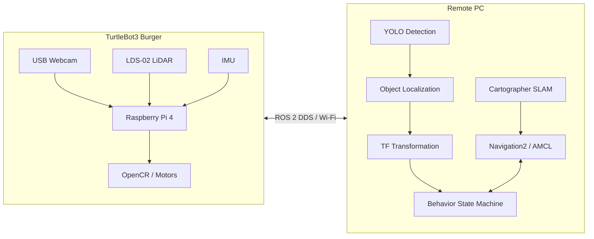
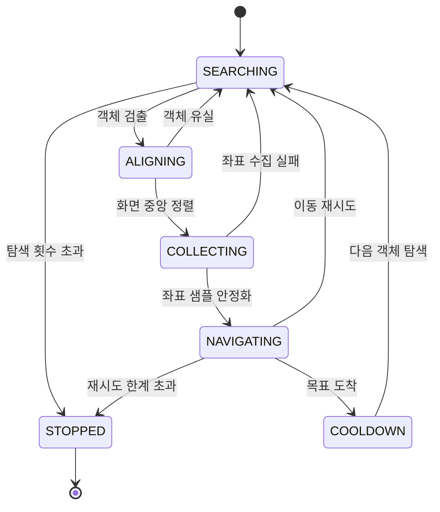

# Nav2gather

**ROS 2 Navigation2와 YOLO를 결합한 TurtleBot3 객체 인식 자율주행 시스템**

TurtleBot3가 카메라로 목표 객체를 인식하고, 객체의 위치를 `map` 좌표계로 변환한 뒤 Navigation2 목표로 설정하여 스스로 접근한다.

<video src="videos/demo.MP4" controls autoplay loop muted playsinline width="900">
데모 영상: <a href="videos/demo.MP4">demo.MP4</a>
</video>

<sub><i>SLAM · Navigation2 · Object Detection · Object Localization · Behavior가 결합된 전체 시스템 동작</i></sub>

## 핵심 기능

- **Cartographer SLAM**을 이용한 지도 생성
- **AMCL 및 Navigation2** 기반 위치 추정과 자율주행
- **YOLO** 기반 실시간 객체 인식
- 카메라 좌표를 `map` 좌표로 변환하는 **Object Localization**
- 객체 탐색부터 접근까지 제어하는 **Behavior State Machine**
- 고부하 연산을 Remote PC에서 수행하는 **Offloading Architecture**

## 목차

- [프로젝트 개요](#프로젝트-개요)
- [시스템 구성](#시스템-구성)
- [전체 동작 흐름](#전체-동작-흐름)
- [개발 환경](#개발-환경)
- [주요 구현](#주요-구현)
  - [SLAM](#slam)
  - [Navigation2](#navigation2)
  - [YOLO Object Detection](#yolo-object-detection)
  - [Object Localization](#object-localization)
  - [Behavior State Machine](#behavior-state-machine)
- [구현 결과](#구현-결과)
- [향후 계획](#향후-계획)
- [문서](#문서)

## 프로젝트 개요

**Nav2gather**는 TurtleBot3 Burger 한 대에 Navigation2, YOLO Object Detection, Object Localization, Behavior를 통합한 객체 인식 자율주행 시스템이다.

기존 Navigation2 예제에서는 사용자가 RViz에서 직접 목적지를 지정한다. 본 프로젝트에서는 카메라 영상에서 인식한 객체를 목적지로 사용한다. YOLO가 목표 객체를 검출하면 Object Localization 노드가 객체의 위치를 추정하고, TF 변환을 통해 해당 좌표를 `map` 좌표계로 변환한다. Behavior 노드는 변환된 좌표를 바탕으로 객체 앞 접근 지점을 생성하여 Navigation2에 전달한다.

TurtleBot3의 Raspberry Pi는 LiDAR, IMU, 웹캠 등 센서 데이터 수집과 모터 제어를 담당한다. SLAM, Navigation2, YOLO 추론, Object Localization, Behavior와 같이 연산량이 큰 작업은 Remote PC에서 실행하는 **Offloading Architecture**를 적용하였다.

현재 시스템은 단일 TurtleBot3를 대상으로 구현되었으며, 이후 Frontier Exploration과 Multi-Robot Navigation으로 확장할 수 있는 구조를 목표로 한다.

## 시스템 구성

로봇은 센서 데이터 수집과 구동을 담당하고, Remote PC는 지도 생성, 객체 인식, 위치 추정, 경로 계획 및 상위 행동 결정을 수행한다. 두 장치는 ROS 2 DDS를 통해 통신한다.



## 전체 동작 흐름

```text
USB Webcam
     │
     ▼
YOLO Object Detection
     │
     ▼
Object Localization
     │
     ▼
camera_optical_frame → base_link → odom → map
     │
     ▼
Behavior State Machine
     │
     ▼
Navigation2 Goal 생성
     │
     ▼
경로 계획 및 장애물 회피
     │
     ▼
목표 객체 앞까지 이동
```

## 개발 환경

| 구분 | 내용 |
|---|---|
| **OS** | Ubuntu 24.04 LTS |
| **Middleware** | ROS 2 Jazzy |
| **Robot Platform** | TurtleBot3 Burger |
| **SBC** | Raspberry Pi 4 |
| **Controller** | OpenCR |
| **LiDAR** | LDS-02 |
| **Camera** | Logitech C920 USB Webcam |
| **Visualization** | RViz2 |
| **Simulation** | Gazebo Harmonic |
| **Language** | Python, C++ |
| **Build System** | colcon |

### 기술 스택

| 영역 | 구성 |
|---|---|
| **Navigation** | Navigation2, AMCL, Cartographer SLAM, `nav2_simple_commander` |
| **Perception** | `yolo_ros`, Ultralytics YOLO, USB Webcam, GStreamer |
| **Localization** | TF2, `PointStamped`, Pinhole Camera Model, LiDAR Clustering |
| **Behavior** | Python State Machine, `BasicNavigator` |

## 주요 구현

### SLAM

Cartographer와 LiDAR 스캔을 이용하여 실시간 점유 격자 지도(occupancy grid map)를 생성한다. TurtleBot3를 Teleoperation으로 이동시키며 주변 환경을 스캔하고, 완성된 지도는 Navigation2에서 사용할 수 있도록 `map.yaml`과 `map.pgm`으로 저장한다.

<table>
<tr>
<td width="45%">


<sub><i>Cartographer SLAM으로 생성한 점유 격자 지도</i></sub>

</td>
<td width="55%">

<video src="videos/slam.MP4" controls width="100%">
데모 영상: <a href="videos/slam.MP4">slam.MP4</a>
</video>

<sub><i>LiDAR 기반 실시간 지도 생성 과정</i></sub>

</td>
</tr>
</table>

### Navigation2

저장한 지도에서 AMCL로 TurtleBot3의 현재 위치를 추정한다. Navigation2는 전역 경로와 지역 경로를 생성하고, 장애물을 회피하며 목표 지점까지 이동한다.

Behavior 노드는 `nav2_simple_commander`의 `BasicNavigator`를 사용하여 객체 앞 접근 지점을 Navigation2 목표로 전달한다.

<video src="videos/navigation.mp4" controls width="720">
데모 영상: <a href="videos/navigation.mp4">navigation.mp4</a>
</video>

<sub><i>AMCL 위치 추정과 Navigation2 목표 지점 자율 이동</i></sub>

### YOLO Object Detection

Raspberry Pi에 연결된 USB 웹캠 영상을 GStreamer UDP로 Remote PC에 전송한다. Remote PC의 `gscam`은 수신한 영상을 `/camera/image_raw` Topic으로 변환하고, `yolo_ros`가 해당 영상을 구독하여 실시간 객체 인식을 수행한다.

목표 클래스와 신뢰도 임계값을 적용해 필요한 객체만 선별하고, Bounding Box 중심과 크기를 Object Localization에 전달한다.

<div align="center">

<video src="videos/yolo_detection.mp4" controls width="720">
데모 영상: <a href="videos/yolo_detection.mp4">yolo_detection.mp4</a>
</video>

<sub><i>USB 웹캠 영상에서 목표 객체를 실시간으로 탐지하는 모습</i></sub>

</div>

### Object Localization

검출된 Bounding Box의 폭과 실제 객체 너비, 카메라 초점거리를 이용하여 객체까지의 거리를 추정한다.

```text
distance = (real_object_width × focal_length_px) / bbox_width_px
```

객체의 영상 중심 위치를 이용해 방위각을 계산하고, 필요에 따라 LiDAR 스캔 클러스터링을 결합하여 위치를 보정한다.

추정된 좌표는 다음 TF 체인을 통해 `map` 좌표계로 변환된다.

```text
camera_optical_frame
        │
        ▼
camera_link
        │
        ▼
base_link
        │
        ▼
odom
        │
        ▼
map
```

Behavior 노드는 최종적으로 변환된 `map` 좌표를 이용하여 객체 앞 접근 목표를 생성한다.

### Behavior State Machine

Behavior 노드는 객체 탐색, 정렬, 좌표 수집, 목표 생성, Navigation2 이동, 재탐색을 하나의 상태 머신으로 관리한다.



| 상태 | 설명 |
|---|---|
| `SEARCHING` | 제자리 회전하며 목표 객체 탐색 |
| `ALIGNING` | 객체가 영상 중앙에 오도록 방향 정렬 |
| `COLLECTING` | 여러 프레임의 객체 좌표를 수집하고 평균화 |
| `NAVIGATING` | 객체 앞 접근 지점을 Nav2 목표로 설정하여 이동 |
| `COOLDOWN` | 도착 후 일정 시간 정지하고 방문 좌표 기록 |
| `STOPPED` | 탐색 또는 이동 재시도 한계 초과 시 안전 종료 |

이미 방문한 객체의 `map` 좌표는 방문 목록에 저장되며, 다음 탐색에서 동일 객체를 다시 목표로 선택하지 않도록 제외한다.

<video src="videos/Behavior%20Demo.mp4" controls width="720">
데모 영상: <a href="videos/Behavior%20Demo.mp4">Behavior Demo.mp4</a>
</video>

<sub><i>Searching → Aligning → Collecting → Navigating → Cooldown으로 이어지는 전체 Behavior 루프</i></sub>

## 구현 결과

| 항목 | 상태 |
|---|:---:|
| TurtleBot3 Bringup | 완료 |
| Cartographer 기반 SLAM | 완료 |
| AMCL Localization | 완료 |
| Navigation2 기반 자율주행 | 완료 |
| GStreamer 기반 웹캠 영상 전송 | 완료 |
| YOLO 기반 객체 인식 | 완료 |
| Pinhole Camera Model 기반 거리 추정 | 완료 |
| Camera-LiDAR 융합 위치 보정 | 완료 |
| TF 좌표 변환 (`camera` → `map`) | 완료 |
| Behavior 상태 머신 기반 객체 탐색 및 접근 | 완료 |
| 동일 객체 재방문 방지 | 완료 |
| 탐색 횟수 제한 및 안전 종료 | 완료 |
| Frontier Exploration | 연동 구조 구성, 실환경 검증 진행 중 |
| Multi-Robot Navigation | 계획 단계 |

## 향후 계획

- **Frontier Exploration**
  - 목적지가 주어지지 않은 상황에서 미탐색 영역을 자동 선택
  - Frontier 기반 자율 탐색 실환경 검증

- **Navigation Recovery**
  - 이동 실패 시 재시도 횟수 관리
  - 후진, 회전, Costmap 초기화 등의 Recovery Behavior 연동
  - Navigation2 Behavior Tree 분석 및 개선

- **Multi-Robot Navigation**
  - TurtleBot3 Burger와 Waffle의 Namespace 기반 다중 로봇 환경 구성
  - 로봇 간 지도 및 목표 좌표 공유
  - Costmap 기반 상호 회피와 MAPF 기반 경로 조율

## 문서

프로젝트 재현을 위한 설치 및 실행 가이드는 `docs/` 폴더에 정리되어 있다.

| 문서 | 내용 |
|---|---|
| [01. Guidebook — Part 1](docs/01_Guidebook_Part1.md) | 개발 환경 구축, Raspberry Pi 설정, TurtleBot3 Bringup |
| [02. Guidebook — Part 2](docs/02_Guidebook_Part2.md) | SLAM, 지도 저장, AMCL, Navigation2 |
| [03. Webcam Setup](docs/03_Webcam_Setup.md) | USB Webcam, GStreamer, `gscam`, YOLO 연동 |
| [04. Troubleshooting](docs/04_Troubleshooting.md) | 개발 중 발생한 주요 오류와 해결 방법 |
