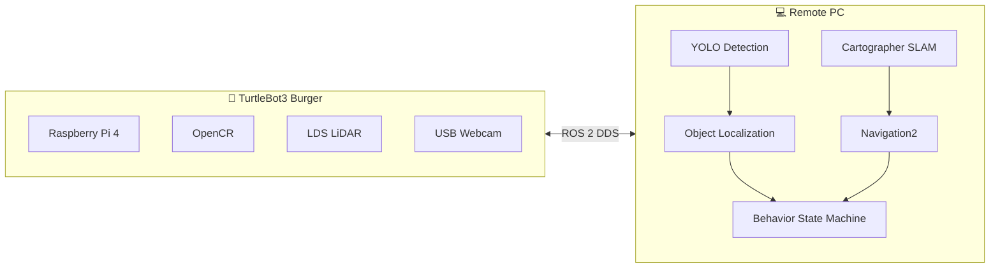
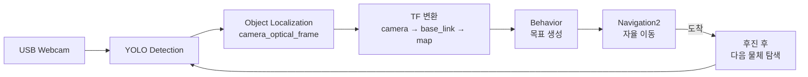
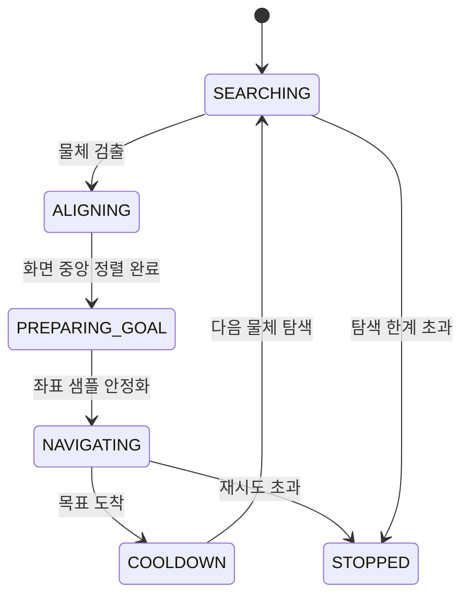
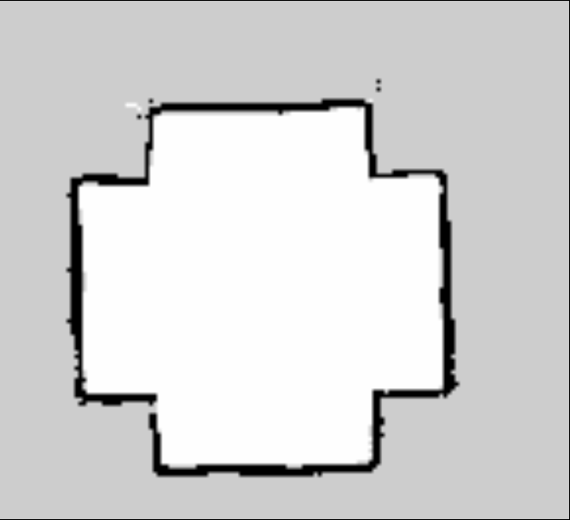

<div align="center">

# 🤖 NAV2GATHER

### YOLO 객체 인식 × Navigation2 자율주행 기반 자율 수거(Autonomous Gathering) 로봇

*로봇이 스스로 물체를 찾고(Perception) → 위치를 추정하고(Localization) → 목적지까지 걸어갑니다(Nav2 + Behavior).*


</div>

<br>

<div align="center">
  <video src="videos/Behavior%20Demo.mp4" controls width="720">
    데모 영상: <a href="videos/Behavior%20Demo.mp4">Behavior Demo.mp4</a>
  </video>
  <br>
  <sub>▲ YOLO 인식 → 좌표 추정 → Nav2 자율주행까지 이어지는 전체 Behavior 루프</sub>
</div>

<br>

## 📖 목차

- [프로젝트 소개](#-프로젝트-소개)
- [핵심 강점](#-핵심-강점)
- [시스템 아키텍처](#️-시스템-아키텍처)
- [인식 → 추정 → 주행 파이프라인](#-인식--추정--주행-파이프라인)
- [Behavior 상태 머신](#-behavior-상태-머신)
- [SLAM & Navigation2](#️-slam--navigation2)
- [기술 스택](#️-기술-스택)
- [프로젝트 구조](#-프로젝트-구조)
- [구현 현황](#-구현-현황)
- [향후 계획](#-향후-계획)
- [문서](#-문서)

---

## 🎯 프로젝트 소개

**NAV2GATHER**는 TurtleBot3 Burger 한 대가 카메라로 물체를 스스로 찾아내고, 그 위치까지 자율주행으로 이동하는 로봇 시스템이다.

사람이 RViz에서 목적지를 직접 지정해주는 일반적인 Navigation2 데모와 달리, 이 프로젝트는 **YOLO가 인식한 물체 자체를 Navigation Goal로 변환**한다. 로봇은 제자리 회전으로 물체를 탐색하고, 화면 중앙으로 정렬한 뒤, 카메라 좌표를 map 좌표로 변환해 접근 목표를 만들고, Nav2로 이동한다. 목표에 도착하면 후진 후 다음 물체를 다시 탐색하는 과정을 반복하며 — 이름 그대로 **여러 물체를 순서대로 "gather"** 한다.

TurtleBot3 Burger 자체는 라즈베리파이 4 + LiDAR + USB 웹캠으로 센서 수집과 구동만 담당하고, SLAM · Navigation2 · YOLO 추론처럼 연산량이 큰 작업은 전부 Remote PC로 넘기는 **Offloading 아키텍처**를 채택했다. 저사양 임베디드 로봇에서도 실시간 인식과 자율주행을 동시에 구현할 수 있음을 보여주는 것이 이 프로젝트의 핵심이다.

## ✨ 핵심 강점

이 프로젝트를 다른 TurtleBot3 Navigation2 예제와 구분 짓는 지점은 아래 네 가지다.

<table>
<tr>
<td width="25%" align="center">🎯<br><b>객체 인식</b></td>
<td>USB 웹캠 영상을 <code>yolo_ros</code>로 실시간 추론해 목표 물체(bottle)를 탐지한다. 신뢰도(score) 임계값과 bbox 크기 필터로 오검출을 걸러낸다.</td>
</tr>
<tr>
<td align="center">📍<br><b>좌표 추정</b></td>
<td>Bounding Box 폭과 카메라 초점거리를 이용한 <b>Pinhole 카메라 모델</b>로 단안 카메라만으로 물체까지의 3D 거리·방향을 추정한다. 별도 구현으로 <b>LiDAR 클러스터링과 YOLO 방위각을 융합</b>해 더 강건하게 위치를 보정하는 방식도 포함되어 있다.</td>
</tr>
<tr>
<td align="center">🧭<br><b>Navigation2</b></td>
<td>Cartographer SLAM으로 생성한 지도 위에서 AMCL로 위치를 추정하고, <code>nav2_simple_commander</code>를 통해 전역/지역 경로 계획과 장애물 회피를 수행한다.</td>
</tr>
<tr>
<td align="center">🔄<br><b>Behavior 자율주행</b></td>
<td>탐색 → 정렬 → 목표 생성 → 이동 → 재탐색을 순환하는 상태 머신으로, 사람의 개입 없이 여러 물체를 순서대로 방문한다. 이미 방문한 물체는 좌표 기반으로 자동 제외한다.</td>
</tr>
</table>

## 🏗️ 시스템 아키텍처

로봇은 센서·구동만 담당하고, 연산이 무거운 SLAM·Navigation2·YOLO·Behavior는 Remote PC에서 실행되며 두 장치는 ROS 2 DDS로 통신한다.



## 🔄 인식 → 추정 → 주행 파이프라인



<div align="center">
  <video src="videos/yolo_detection.mp4" controls width="640">
    데모 영상: <a href="videos/yolo_detection.mp4">yolo_detection.mp4</a>
  </video>
  <br>
  <sub>▲ USB 웹캠 영상에서 YOLO가 bottle을 실시간으로 탐지하는 모습</sub>
</div>

로봇 좌표계는 `camera_optical_frame → camera_link → base_link → odom → map`으로 정적/동적 TF 변환을 거쳐 연결되며, 카메라 장착 위치(전방 10cm, 상단 12cm)는 정적 TF로 보정되어 있다.

## 🧠 Behavior 상태 머신

로봇은 아래 상태를 순환하며 물체를 탐색하고 접근한다. 실패 시에는 정지 상태로 안전하게 빠져나온다.



| 상태 | 설명 |
|---|---|
| `SEARCHING` | 제자리 회전하며 YOLO가 물체를 검출할 때까지 탐색 |
| `ALIGNING` | 각도 오차를 계산해 물체가 화면 중앙에 오도록 정렬 |
| `PREPARING_GOAL` | 여러 프레임의 map 좌표 샘플을 모아 중앙값으로 안정화 |
| `NAVIGATING` | 안정화된 좌표 앞 정지 지점을 목표로 생성해 Nav2로 이동 |
| `COOLDOWN` | 도착 후 대기하며 같은 물체를 재탐색하지 않도록 방지 |
| `STOPPED` | 재시도 한도를 초과하거나 더 이상 물체를 찾지 못해 종료 |

이미 방문한 물체의 map 좌표는 계속 기억되어, 다음 탐색 루프에서 자동으로 제외된다 — 여러 개의 물체를 순서대로 수거하는 **NAV2GATHER**의 핵심 동작이다.

## 🗺️ SLAM & Navigation2

<table>
<tr>
<td width="45%">



<sub>▲ Cartographer SLAM으로 생성한 점유 격자 지도(occupancy grid map)</sub>

</td>
<td width="55%">

<video src="videos/slam.MP4" controls width="100%">
  데모 영상: <a href="videos/slam.MP4">slam.MP4</a>
</video>

<sub>▲ LiDAR 기반 실시간 지도 생성 과정</sub>

</td>
</tr>
</table>

<div align="center">
  <video src="videos/navigation.mp4" controls width="640">
    데모 영상: <a href="videos/navigation.mp4">navigation.mp4</a>
  </video>
  <br>
  <sub>▲ 저장된 지도 위에서 AMCL 위치 추정과 Navigation2 목표 지점 이동</sub>
</div>

## ⚙️ 기술 스택

| 구분 | 내용 |
|---|---|
| **OS** | Ubuntu 24.04 LTS |
| **Middleware** | ROS 2 Jazzy |
| **Robot Platform** | TurtleBot3 Burger (Raspberry Pi 4 · OpenCR · LDS-02 LiDAR) |
| **Perception** | USB Webcam · [`yolo_ros`](code/yolo_ws/src/yolo_ros) (Ultralytics YOLO) |
| **Navigation** | Navigation2 · Cartographer SLAM · `nav2_simple_commander` |
| **Simulation / Viz** | Gazebo Harmonic · RViz2 |
| **Language** | Python · C++ |
| **Build System** | colcon |

## 📂 프로젝트 구조

```text
Nav2gather/
├── code/
│   ├── turtlebot3_ws/                  🍓 Raspberry Pi — 센서 · 구동
│   └── yolo_ws/                        💻 Remote PC — 인식 · 자율주행
│       └── src/
│           ├── yolo_ros/                    YOLO 추론 (외부 오픈소스 패키지)
│           ├── nav2_behavior/                Object Localization · TF · Behavior 상태 머신
│           ├── frontier_exploration_ros2/    Frontier Exploration (외부 패키지, 연동 중)
│           ├── yolo_behavior/                 Behavior 초기 실험 노드
│           └── bottle_behavior/              탐지 후 정지 실험 노드
├── docs/                                설치 · 실행 가이드북
├── images/                              스크린샷 · 다이어그램
├── videos/                              시연 영상
└── presentation/                        발표 자료
```

> `yolo_ros`, `frontier_exploration_ros2`는 각각 [mgonzs13](https://github.com/mgonzs13/yolo_ros), [mertgulerx](https://github.com/mertgulerx/frontier-exploration-ros2)의 오픈소스 패키지를 워크스페이스에 통합해 사용한다.

## ✅ 구현 현황

| 항목 | 상태 |
|---|:---:|
| TurtleBot3 Bringup | ✅ |
| Cartographer 기반 SLAM | ✅ |
| Navigation2 기반 자율주행 | ✅ |
| YOLO 기반 물체(bottle) 객체 인식 | ✅ |
| Object Localization (Pinhole 모델 3D 위치 추정) | ✅ |
| Camera–LiDAR 융합 위치 보정 | ✅ |
| TF 좌표 변환 (camera → map) | ✅ |
| Behavior 상태 머신 기반 자율 탐색 · 접근 | ✅ |
| 다중 물체 순차 수거 (방문 이력 관리) | ✅ |
| Frontier Exploration 자율 탐색 | 🔄 연동 구조 구성, 실환경 검증 진행 중 |

## 🔭 향후 계획

- **Autonomous Exploration** — Frontier Exploration 실환경 검증, 목적지 자동 탐색
- **Navigation Behavior 고도화** — 실패 시 재시도 전략 · Recovery Behavior · Behavior Tree 분석
- **Multi Robot Navigation** — Burger · Waffle 동시 자율주행, Namespace 기반 다중 로봇 환경
- **Costmap 기반 Robot Avoidance** — 로봇 간 자연스러운 회피
- **MAPF (Multi-Agent Path Finding)** — 다중 로봇 충돌 없는 경로 계획

## 📚 문서

프로젝트를 처음부터 재현하기 위한 상세 가이드는 `docs/` 폴더에 정리되어 있다.

| 문서 | 내용 |
|---|---|
| [01. Guidebook — Part 1](docs/01_Guidebook_Part1) | 개발 환경 구축 · TurtleBot3 Bringup |
| [02. Guidebook — Part 2](docs/02_Guidebook_Part2) | SLAM · Navigation2 |
| [03. Webcam Setup](docs/03_Webcam_Setup) | USB Webcam · YOLO 연동 |
| [04. Troubleshooting](docs/04_Troubleshooting) | 개발 중 발생한 문제와 해결 기록 |
<div align="center">

# 🤖 NAV2GATHER

### YOLO 객체 인식 × Navigation2 자율주행 기반 자율 수거(Autonomous Gathering) 로봇

*로봇이 스스로 물체를 찾고(Perception) → 위치를 추정하고(Localization) → 목적지까지 걸어갑니다(Nav2 + Behavior).*


</div>

<br>

<div align="center">
  <video src="videos/Behavior%20Demo.mp4" controls width="720">
    데모 영상: <a href="videos/Behavior%20Demo.mp4">Behavior Demo.mp4</a>
  </video>
  <br>
  <sub>▲ YOLO 인식 → 좌표 추정 → Nav2 자율주행까지 이어지는 전체 Behavior 루프</sub>
</div>

<br>

## 📖 목차

- [프로젝트 소개](#-프로젝트-소개)
- [핵심 강점](#-핵심-강점)
- [시스템 아키텍처](#️-시스템-아키텍처)
- [인식 → 추정 → 주행 파이프라인](#-인식--추정--주행-파이프라인)
- [Behavior 상태 머신](#-behavior-상태-머신)
- [SLAM & Navigation2](#️-slam--navigation2)
- [기술 스택](#️-기술-스택)
- [프로젝트 구조](#-프로젝트-구조)
- [구현 현황](#-구현-현황)
- [향후 계획](#-향후-계획)
- [문서](#-문서)

---

## 🎯 프로젝트 소개

**NAV2GATHER**는 TurtleBot3 Burger 한 대가 카메라로 물체를 스스로 찾아내고, 그 위치까지 자율주행으로 이동하는 로봇 시스템이다.

사람이 RViz에서 목적지를 직접 지정해주는 일반적인 Navigation2 데모와 달리, 이 프로젝트는 **YOLO가 인식한 물체 자체를 Navigation Goal로 변환**한다. 로봇은 제자리 회전으로 물체를 탐색하고, 화면 중앙으로 정렬한 뒤, 카메라 좌표를 map 좌표로 변환해 접근 목표를 만들고, Nav2로 이동한다. 목표에 도착하면 후진 후 다음 물체를 다시 탐색하는 과정을 반복하며 — 이름 그대로 **여러 물체를 순서대로 "gather"** 한다.

TurtleBot3 Burger 자체는 라즈베리파이 4 + LiDAR + USB 웹캠으로 센서 수집과 구동만 담당하고, SLAM · Navigation2 · YOLO 추론처럼 연산량이 큰 작업은 전부 Remote PC로 넘기는 **Offloading 아키텍처**를 채택했다. 저사양 임베디드 로봇에서도 실시간 인식과 자율주행을 동시에 구현할 수 있음을 보여주는 것이 이 프로젝트의 핵심이다.

## ✨ 핵심 강점

이 프로젝트를 다른 TurtleBot3 Navigation2 예제와 구분 짓는 지점은 아래 네 가지다.

<table>
<tr>
<td width="25%" align="center">🎯<br><b>객체 인식</b></td>
<td>USB 웹캠 영상을 <code>yolo_ros</code>로 실시간 추론해 목표 물체(bottle)를 탐지한다. 신뢰도(score) 임계값과 bbox 크기 필터로 오검출을 걸러낸다.</td>
</tr>
<tr>
<td align="center">📍<br><b>좌표 추정</b></td>
<td>Bounding Box 폭과 카메라 초점거리를 이용한 <b>Pinhole 카메라 모델</b>로 단안 카메라만으로 물체까지의 3D 거리·방향을 추정한다. 별도 구현으로 <b>LiDAR 클러스터링과 YOLO 방위각을 융합</b>해 더 강건하게 위치를 보정하는 방식도 포함되어 있다.</td>
</tr>
<tr>
<td align="center">🧭<br><b>Navigation2</b></td>
<td>Cartographer SLAM으로 생성한 지도 위에서 AMCL로 위치를 추정하고, <code>nav2_simple_commander</code>를 통해 전역/지역 경로 계획과 장애물 회피를 수행한다.</td>
</tr>
<tr>
<td align="center">🔄<br><b>Behavior 자율주행</b></td>
<td>탐색 → 정렬 → 목표 생성 → 이동 → 재탐색을 순환하는 상태 머신으로, 사람의 개입 없이 여러 물체를 순서대로 방문한다. 이미 방문한 물체는 좌표 기반으로 자동 제외한다.</td>
</tr>
</table>

## 🏗️ 시스템 아키텍처

로봇은 센서·구동만 담당하고, 연산이 무거운 SLAM·Navigation2·YOLO·Behavior는 Remote PC에서 실행되며 두 장치는 ROS 2 DDS로 통신한다.


## 🔄 인식 → 추정 → 주행 파이프라인


<div align="center">
  <video src="videos/yolo_detection.mp4" controls width="640">
    데모 영상: <a href="videos/yolo_detection.mp4">yolo_detection.mp4</a>
  </video>
  <br>
  <sub>▲ USB 웹캠 영상에서 YOLO가 bottle을 실시간으로 탐지하는 모습</sub>
</div>

로봇 좌표계는 `camera_optical_frame → camera_link → base_link → odom → map`으로 정적/동적 TF 변환을 거쳐 연결되며, 카메라 장착 위치(전방 10cm, 상단 12cm)는 정적 TF로 보정되어 있다.

## 🧠 Behavior 상태 머신

로봇은 아래 상태를 순환하며 물체를 탐색하고 접근한다. 실패 시에는 정지 상태로 안전하게 빠져나온다.


| 상태 | 설명 |
|---|---|
| `SEARCHING` | 제자리 회전하며 YOLO가 물체를 검출할 때까지 탐색 |
| `ALIGNING` | 각도 오차를 계산해 물체가 화면 중앙에 오도록 정렬 |
| `PREPARING_GOAL` | 여러 프레임의 map 좌표 샘플을 모아 중앙값으로 안정화 |
| `NAVIGATING` | 안정화된 좌표 앞 정지 지점을 목표로 생성해 Nav2로 이동 |
| `COOLDOWN` | 도착 후 대기하며 같은 물체를 재탐색하지 않도록 방지 |
| `STOPPED` | 재시도 한도를 초과하거나 더 이상 물체를 찾지 못해 종료 |

이미 방문한 물체의 map 좌표는 계속 기억되어, 다음 탐색 루프에서 자동으로 제외된다 — 여러 개의 물체를 순서대로 수거하는 **NAV2GATHER**의 핵심 동작이다.

## 🗺️ SLAM & Navigation2

<table>
<tr>
<td width="45%">


<sub>▲ Cartographer SLAM으로 생성한 점유 격자 지도(occupancy grid map)</sub>

</td>
<td width="55%">

<video src="videos/slam.MP4" controls width="100%">
  데모 영상: <a href="videos/slam.MP4">slam.MP4</a>
</video>

<sub>▲ LiDAR 기반 실시간 지도 생성 과정</sub>

</td>
</tr>
</table>

<div align="center">
  <video src="videos/navigation.mp4" controls width="640">
    데모 영상: <a href="videos/navigation.mp4">navigation.mp4</a>
  </video>
  <br>
  <sub>▲ 저장된 지도 위에서 AMCL 위치 추정과 Navigation2 목표 지점 이동</sub>
</div>

## ⚙️ 기술 스택

| 구분 | 내용 |
|---|---|
| **OS** | Ubuntu 24.04 LTS |
| **Middleware** | ROS 2 Jazzy |
| **Robot Platform** | TurtleBot3 Burger (Raspberry Pi 4 · OpenCR · LDS-02 LiDAR) |
| **Perception** | USB Webcam · [`yolo_ros`](code/yolo_ws/src/yolo_ros) (Ultralytics YOLO) |
| **Navigation** | Navigation2 · Cartographer SLAM · `nav2_simple_commander` |
| **Simulation / Viz** | Gazebo Harmonic · RViz2 |
| **Language** | Python · C++ |
| **Build System** | colcon |

## 📂 프로젝트 구조

```text
Nav2gather/
├── code/
│   ├── turtlebot3_ws/                  🍓 Raspberry Pi — 센서 · 구동
│   └── yolo_ws/                        💻 Remote PC — 인식 · 자율주행
│       └── src/
│           ├── yolo_ros/                    YOLO 추론 (외부 오픈소스 패키지)
│           ├── nav2_behavior/                Object Localization · TF · Behavior 상태 머신
│           ├── frontier_exploration_ros2/    Frontier Exploration (외부 패키지, 연동 중)
│           ├── yolo_behavior/                 Behavior 초기 실험 노드
│           └── bottle_behavior/              탐지 후 정지 실험 노드
├── docs/                                설치 · 실행 가이드북
├── images/                              스크린샷 · 다이어그램
├── videos/                              시연 영상
└── presentation/                        발표 자료
```

> `yolo_ros`, `frontier_exploration_ros2`는 각각 [mgonzs13](https://github.com/mgonzs13/yolo_ros), [mertgulerx](https://github.com/mertgulerx/frontier-exploration-ros2)의 오픈소스 패키지를 워크스페이스에 통합해 사용한다.

## ✅ 구현 현황

| 항목 | 상태 |
|---|:---:|
| TurtleBot3 Bringup | ✅ |
| Cartographer 기반 SLAM | ✅ |
| Navigation2 기반 자율주행 | ✅ |
| YOLO 기반 물체(bottle) 객체 인식 | ✅ |
| Object Localization (Pinhole 모델 3D 위치 추정) | ✅ |
| Camera–LiDAR 융합 위치 보정 | ✅ |
| TF 좌표 변환 (camera → map) | ✅ |
| Behavior 상태 머신 기반 자율 탐색 · 접근 | ✅ |
| 다중 물체 순차 수거 (방문 이력 관리) | ✅ |
| Frontier Exploration 자율 탐색 | 🔄 연동 구조 구성, 실환경 검증 진행 중 |

## 🔭 향후 계획

- **Autonomous Exploration** — Frontier Exploration 실환경 검증, 목적지 자동 탐색
- **Navigation Behavior 고도화** — 실패 시 재시도 전략 · Recovery Behavior · Behavior Tree 분석
- **Multi Robot Navigation** — Burger · Waffle 동시 자율주행, Namespace 기반 다중 로봇 환경
- **Costmap 기반 Robot Avoidance** — 로봇 간 자연스러운 회피
- **MAPF (Multi-Agent Path Finding)** — 다중 로봇 충돌 없는 경로 계획

## 📚 문서

프로젝트를 처음부터 재현하기 위한 상세 가이드는 `docs/` 폴더에 정리되어 있다.

| 문서 | 내용 |
|---|---|
| [01. Guidebook — Part 1](docs/01_Guidebook_Part1) | 개발 환경 구축 · TurtleBot3 Bringup |
| [02. Guidebook — Part 2](docs/02_Guidebook_Part2) | SLAM · Navigation2 |
| [03. Webcam Setup](docs/03_Webcam_Setup) | USB Webcam · YOLO 연동 |
| [04. Troubleshooting](docs/04_Troubleshooting) | 개발 중 발생한 문제와 해결 기록 |
<div align="center">

# 🤖 NAV2GATHER

### YOLO 객체 인식 × Navigation2 자율주행 기반 자율 수거(Autonomous Gathering) 로봇

*로봇이 스스로 물체를 찾고(Perception) → 위치를 추정하고(Localization) → 목적지까지 걸어갑니다(Nav2 + Behavior).*


</div>

<br>

<div align="center">
  <video src="videos/Behavior%20Demo.mp4" controls width="720">
    데모 영상: <a href="videos/Behavior%20Demo.mp4">Behavior Demo.mp4</a>
  </video>
  <br>
  <sub>▲ YOLO 인식 → 좌표 추정 → Nav2 자율주행까지 이어지는 전체 Behavior 루프</sub>
</div>

<br>

## 📖 목차

- [프로젝트 소개](#-프로젝트-소개)
- [핵심 강점](#-핵심-강점)
- [시스템 아키텍처](#️-시스템-아키텍처)
- [인식 → 추정 → 주행 파이프라인](#-인식--추정--주행-파이프라인)
- [Behavior 상태 머신](#-behavior-상태-머신)
- [SLAM & Navigation2](#️-slam--navigation2)
- [기술 스택](#️-기술-스택)
- [프로젝트 구조](#-프로젝트-구조)
- [구현 현황](#-구현-현황)
- [향후 계획](#-향후-계획)
- [문서](#-문서)

---

## 🎯 프로젝트 소개

**NAV2GATHER**는 TurtleBot3 Burger 한 대가 카메라로 물체를 스스로 찾아내고, 그 위치까지 자율주행으로 이동하는 로봇 시스템이다.

사람이 RViz에서 목적지를 직접 지정해주는 일반적인 Navigation2 데모와 달리, 이 프로젝트는 **YOLO가 인식한 물체 자체를 Navigation Goal로 변환**한다. 로봇은 제자리 회전으로 물체를 탐색하고, 화면 중앙으로 정렬한 뒤, 카메라 좌표를 map 좌표로 변환해 접근 목표를 만들고, Nav2로 이동한다. 목표에 도착하면 후진 후 다음 물체를 다시 탐색하는 과정을 반복하며 — 이름 그대로 **여러 물체를 순서대로 "gather"** 한다.

TurtleBot3 Burger 자체는 라즈베리파이 4 + LiDAR + USB 웹캠으로 센서 수집과 구동만 담당하고, SLAM · Navigation2 · YOLO 추론처럼 연산량이 큰 작업은 전부 Remote PC로 넘기는 **Offloading 아키텍처**를 채택했다. 저사양 임베디드 로봇에서도 실시간 인식과 자율주행을 동시에 구현할 수 있음을 보여주는 것이 이 프로젝트의 핵심이다.

## ✨ 핵심 강점

이 프로젝트를 다른 TurtleBot3 Navigation2 예제와 구분 짓는 지점은 아래 네 가지다.

<table>
<tr>
<td width="25%" align="center">🎯<br><b>객체 인식</b></td>
<td>USB 웹캠 영상을 <code>yolo_ros</code>로 실시간 추론해 목표 물체(bottle)를 탐지한다. 신뢰도(score) 임계값과 bbox 크기 필터로 오검출을 걸러낸다.</td>
</tr>
<tr>
<td align="center">📍<br><b>좌표 추정</b></td>
<td>Bounding Box 폭과 카메라 초점거리를 이용한 <b>Pinhole 카메라 모델</b>로 단안 카메라만으로 물체까지의 3D 거리·방향을 추정한다. 별도 구현으로 <b>LiDAR 클러스터링과 YOLO 방위각을 융합</b>해 더 강건하게 위치를 보정하는 방식도 포함되어 있다.</td>
</tr>
<tr>
<td align="center">🧭<br><b>Navigation2</b></td>
<td>Cartographer SLAM으로 생성한 지도 위에서 AMCL로 위치를 추정하고, <code>nav2_simple_commander</code>를 통해 전역/지역 경로 계획과 장애물 회피를 수행한다.</td>
</tr>
<tr>
<td align="center">🔄<br><b>Behavior 자율주행</b></td>
<td>탐색 → 정렬 → 목표 생성 → 이동 → 재탐색을 순환하는 상태 머신으로, 사람의 개입 없이 여러 물체를 순서대로 방문한다. 이미 방문한 물체는 좌표 기반으로 자동 제외한다.</td>
</tr>
</table>

## 🏗️ 시스템 아키텍처

로봇은 센서·구동만 담당하고, 연산이 무거운 SLAM·Navigation2·YOLO·Behavior는 Remote PC에서 실행되며 두 장치는 ROS 2 DDS로 통신한다.


## 🔄 인식 → 추정 → 주행 파이프라인


<div align="center">
  <video src="videos/yolo_detection.mp4" controls width="640">
    데모 영상: <a href="videos/yolo_detection.mp4">yolo_detection.mp4</a>
  </video>
  <br>
  <sub>▲ USB 웹캠 영상에서 YOLO가 bottle을 실시간으로 탐지하는 모습</sub>
</div>

로봇 좌표계는 `camera_optical_frame → camera_link → base_link → odom → map`으로 정적/동적 TF 변환을 거쳐 연결되며, 카메라 장착 위치(전방 10cm, 상단 12cm)는 정적 TF로 보정되어 있다.

## 🧠 Behavior 상태 머신

로봇은 아래 상태를 순환하며 물체를 탐색하고 접근한다. 실패 시에는 정지 상태로 안전하게 빠져나온다.


| 상태 | 설명 |
|---|---|
| `SEARCHING` | 제자리 회전하며 YOLO가 물체를 검출할 때까지 탐색 |
| `ALIGNING` | 각도 오차를 계산해 물체가 화면 중앙에 오도록 정렬 |
| `PREPARING_GOAL` | 여러 프레임의 map 좌표 샘플을 모아 중앙값으로 안정화 |
| `NAVIGATING` | 안정화된 좌표 앞 정지 지점을 목표로 생성해 Nav2로 이동 |
| `COOLDOWN` | 도착 후 대기하며 같은 물체를 재탐색하지 않도록 방지 |
| `STOPPED` | 재시도 한도를 초과하거나 더 이상 물체를 찾지 못해 종료 |

이미 방문한 물체의 map 좌표는 계속 기억되어, 다음 탐색 루프에서 자동으로 제외된다 — 여러 개의 물체를 순서대로 수거하는 **NAV2GATHER**의 핵심 동작이다.

## 🗺️ SLAM & Navigation2

<table>
<tr>
<td width="45%">


<sub>▲ Cartographer SLAM으로 생성한 점유 격자 지도(occupancy grid map)</sub>

</td>
<td width="55%">

<video src="videos/slam.MP4" controls width="100%">
  데모 영상: <a href="videos/slam.MP4">slam.MP4</a>
</video>

<sub>▲ LiDAR 기반 실시간 지도 생성 과정</sub>

</td>
</tr>
</table>

<div align="center">
  <video src="videos/navigation.mp4" controls width="640">
    데모 영상: <a href="videos/navigation.mp4">navigation.mp4</a>
  </video>
  <br>
  <sub>▲ 저장된 지도 위에서 AMCL 위치 추정과 Navigation2 목표 지점 이동</sub>
</div>

## ⚙️ 기술 스택

| 구분 | 내용 |
|---|---|
| **OS** | Ubuntu 24.04 LTS |
| **Middleware** | ROS 2 Jazzy |
| **Robot Platform** | TurtleBot3 Burger (Raspberry Pi 4 · OpenCR · LDS-02 LiDAR) |
| **Perception** | USB Webcam · [`yolo_ros`](code/yolo_ws/src/yolo_ros) (Ultralytics YOLO) |
| **Navigation** | Navigation2 · Cartographer SLAM · `nav2_simple_commander` |
| **Simulation / Viz** | Gazebo Harmonic · RViz2 |
| **Language** | Python · C++ |
| **Build System** | colcon |

## 📂 프로젝트 구조

```text
Nav2gather/
├── code/
│   ├── turtlebot3_ws/                  🍓 Raspberry Pi — 센서 · 구동
│   └── yolo_ws/                        💻 Remote PC — 인식 · 자율주행
│       └── src/
│           ├── yolo_ros/                    YOLO 추론 (외부 오픈소스 패키지)
│           ├── nav2_behavior/                Object Localization · TF · Behavior 상태 머신
│           ├── frontier_exploration_ros2/    Frontier Exploration (외부 패키지, 연동 중)
│           ├── yolo_behavior/                 Behavior 초기 실험 노드
│           └── bottle_behavior/              탐지 후 정지 실험 노드
├── docs/                                설치 · 실행 가이드북
├── images/                              스크린샷 · 다이어그램
├── videos/                              시연 영상
└── presentation/                        발표 자료
```

> `yolo_ros`, `frontier_exploration_ros2`는 각각 [mgonzs13](https://github.com/mgonzs13/yolo_ros), [mertgulerx](https://github.com/mertgulerx/frontier-exploration-ros2)의 오픈소스 패키지를 워크스페이스에 통합해 사용한다.

## ✅ 구현 현황

| 항목 | 상태 |
|---|:---:|
| TurtleBot3 Bringup | ✅ |
| Cartographer 기반 SLAM | ✅ |
| Navigation2 기반 자율주행 | ✅ |
| YOLO 기반 물체(bottle) 객체 인식 | ✅ |
| Object Localization (Pinhole 모델 3D 위치 추정) | ✅ |
| Camera–LiDAR 융합 위치 보정 | ✅ |
| TF 좌표 변환 (camera → map) | ✅ |
| Behavior 상태 머신 기반 자율 탐색 · 접근 | ✅ |
| 다중 물체 순차 수거 (방문 이력 관리) | ✅ |
| Frontier Exploration 자율 탐색 | 🔄 연동 구조 구성, 실환경 검증 진행 중 |

## 🔭 향후 계획

- **Autonomous Exploration** — Frontier Exploration 실환경 검증, 목적지 자동 탐색
- **Navigation Behavior 고도화** — 실패 시 재시도 전략 · Recovery Behavior · Behavior Tree 분석
- **Multi Robot Navigation** — Burger · Waffle 동시 자율주행, Namespace 기반 다중 로봇 환경
- **Costmap 기반 Robot Avoidance** — 로봇 간 자연스러운 회피
- **MAPF (Multi-Agent Path Finding)** — 다중 로봇 충돌 없는 경로 계획

## 📚 문서

프로젝트를 처음부터 재현하기 위한 상세 가이드는 `docs/` 폴더에 정리되어 있다.

| 문서 | 내용 |
|---|---|
| [01. Guidebook — Part 1](docs/01_Guidebook_Part1) | 개발 환경 구축 · TurtleBot3 Bringup |
| [02. Guidebook — Part 2](docs/02_Guidebook_Part2) | SLAM · Navigation2 |
| [03. Webcam Setup](docs/03_Webcam_Setup) | USB Webcam · YOLO 연동 |
| [04. Troubleshooting](docs/04_Troubleshooting) | 개발 중 발생한 문제와 해결 기록 |
